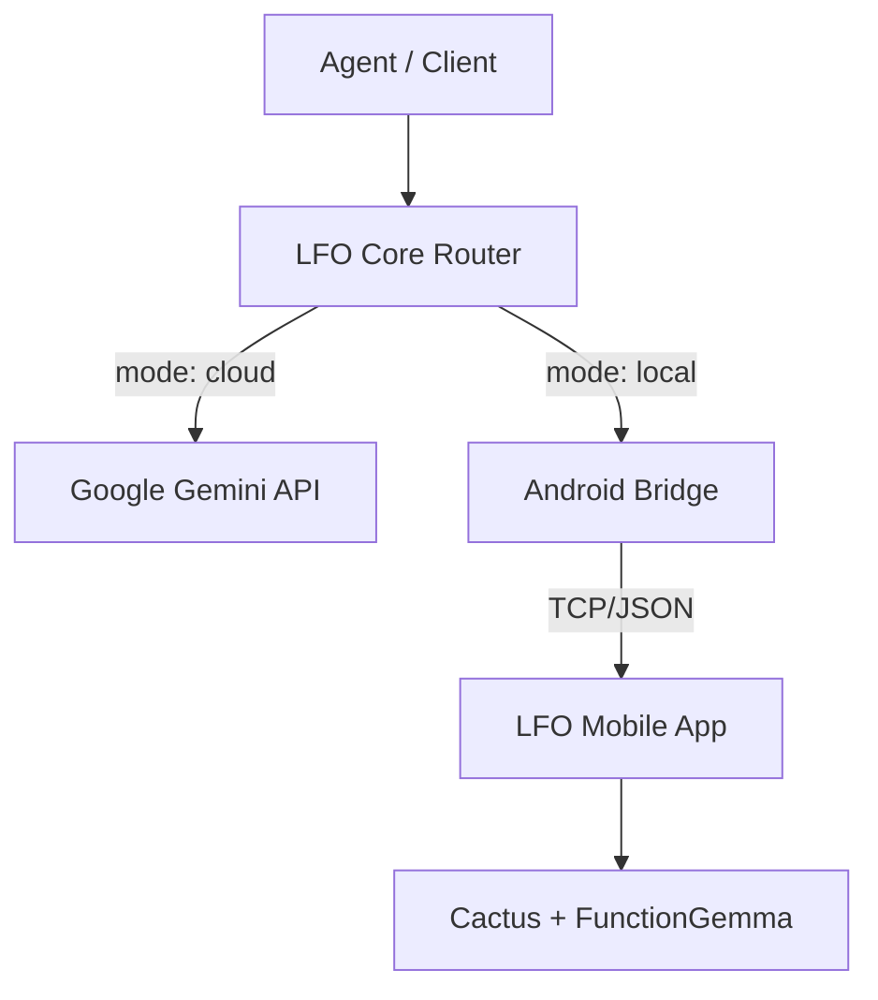
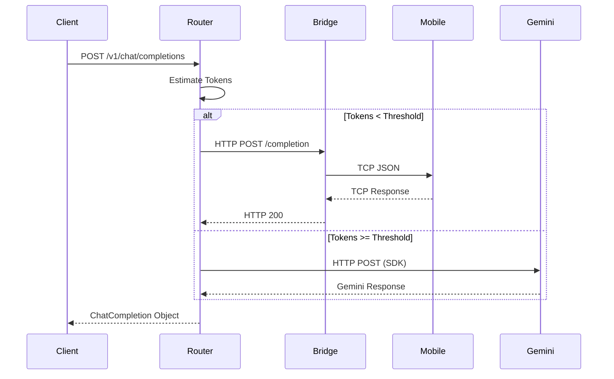

# System Architecture — LocalFirst Orchestrator (LFO)

## Overview
LocalFirst Orchestrator (LFO) is a lightweight hybrid inference router. It exposes a single OpenAI-compatible HTTP endpoint and routes each chat completion request to one of two execution backends: a local LLM running on an Android device (Cactus + FunctionGemma), or Google Gemini running in the cloud.

The system is designed for a single developer or small team running an agentic workflow on a Windows machine, with an Android phone on the same LAN acting as a private, low-latency local inference node.

## Key Requirements
- **Functional**
  - Accept OpenAI-compatible `/v1/chat/completions` requests.
  - Route requests based on `metadata.mode` or token-count heuristics.
  - Normalise responses and errors across backends.
- **Non-functional**
  - **Performance**: Minimise routing overhead (<10ms).
  - **Reliability**: Use circuit breakers for the local path to prevent offline device hang-ups.
  - **Security**: Optional bearer token authentication for LAN security.

## High-Level Architecture
The system consists of three main services: the LFO Core Router, the Android Bridge, and the Mobile Inference App.

Requests arrive at the Core Router, which determines the target. Local requests are sent to the Android Bridge (a Windows-based process), which translates HTTP to the custom TCP protocol used by the mobile app.

## Component Details

### LFO Core Router
- **Responsibilities**: Authentication, routing logic, provider orchestration, usage tracking.
- **Technologies**: Node.js, Express, TypeScript.
- **Communication**: Outbound HTTP to Gemini and Android Bridge.

### Android Bridge
- **Responsibilities**: HTTP-to-TCP translation, connection management for the local device.
- **Technologies**: Node.js.
- **Communication**: Inbound HTTP, outbound raw TCP to the mobile device.

### LFO Mobile App
- **Responsibilities**: On-device inference hosting, model management.
- **Technologies**: React Native, CactusLM, FunctionGemma.
- **Data**: Owns the local GGUF model file.

## Data Flow
### Request Routing (Auto Mode)
1. Client sends request to `/v1/chat/completions`.
2. Router estimates tokens using character-count heuristic (`char/4`).
3. If tokens < `MAX_LOCAL_TOKENS`, route to Local; else, route to Cloud.
4. Response is normalised to OpenAI format and returned.

## Data Model (high-level)
- **ChatRequest**: OpenAI-compatible request body + `metadata` for routing control.
- **ChatResponse**: OpenAI-compatible completion object with `usage` and `model` fields.
- **ProviderStats**: In-memory counters for latency, success/failure rates, and circuit breaker state.

## Infrastructure & Deployment
- **Deployment**: Local execution on Windows (Router + Bridge) and Android (Mobile App).
- **Environments**: Single production-like environment on the user's LAN.
- **Networking**: Requires local network connectivity between the Windows host and Android device.

## Scalability & Reliability
- **Local Path**: Protected by a stateful circuit breaker (`CLOSED`, `OPEN`, `HALF_OPEN`).
- **Cloud Path**: Enforced 60s timeout via `Promise.race` to prevent blocking.
- **Concurrency**: Local path is sequential per-device in v0; Cloud path is concurrent based on API quotas.

## Security & Compliance
- **Authentication**: Optional bearer token check on all inference routes.
- **Privacy**: Local requests never leave the LAN, ensuring data privacy for sensitive prompts.
- **Secrets**: API keys stored in `.env` and never logged.

## Observability
- **Logging**: Structured console logging including target, tokens, latency, and status.
- **Health**: `/health` endpoint for readiness checks.
- **Dashboard**: Web interface for real-time monitoring of requests and backend health.

## Trade-offs & Decisions
- **No Streaming**: Simplifies v0 implementation for both router and mobile client.
- **Character-count tokens**: Chosen for speed over accuracy to keep routing overhead minimal.
- **TCP for Mobile**: Required due to Android background limitations for standard HTTP servers.

## Future Improvements
- [ ] Support for SSE streaming.
- [ ] Multi-device load balancing for local inference.
- [ ] Advanced tokenisation using `tiktoken`.
- [ ] Persistence for usage statistics.
