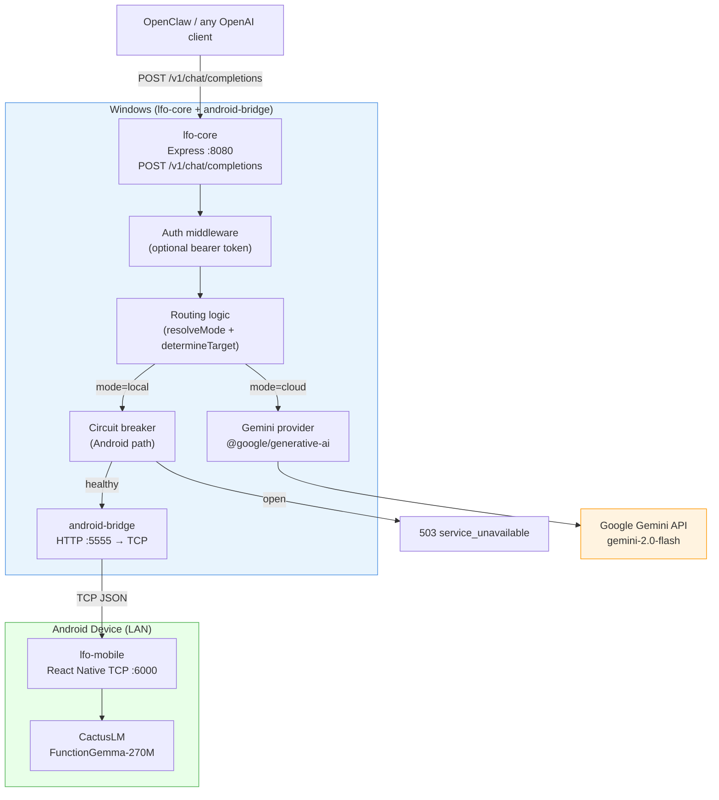
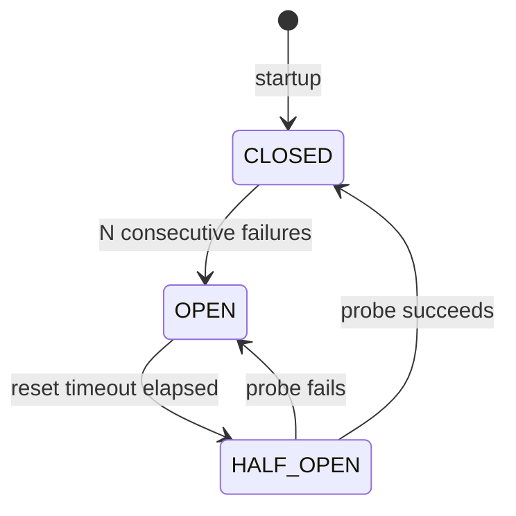
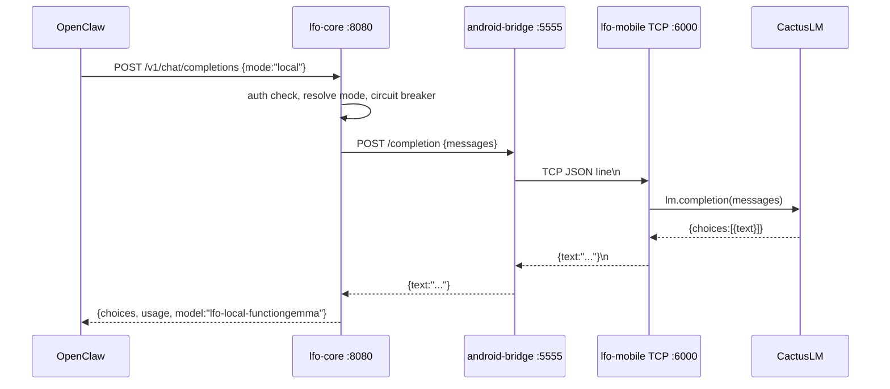
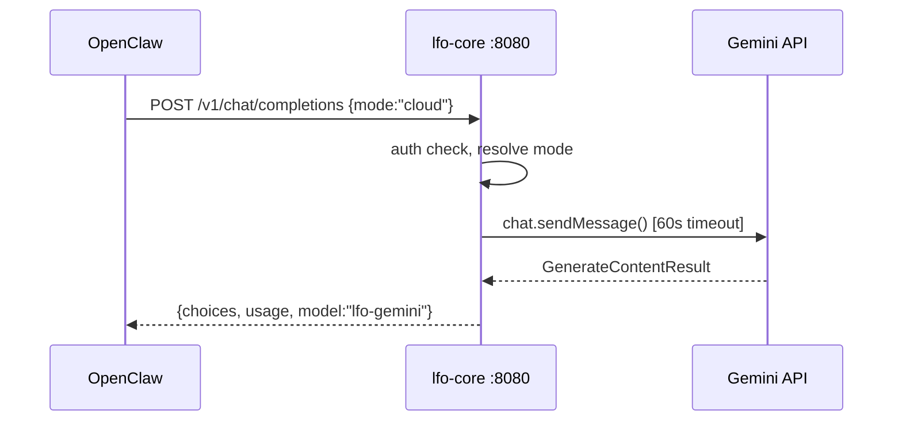

# System Architecture — LocalFirst Orchestrator (LFO)

## Overview

LocalFirst Orchestrator (LFO) is a lightweight hybrid inference router. It exposes a single OpenAI-compatible HTTP endpoint and routes each chat completion request to one of two execution backends: a local LLM running on an Android device (Cactus + FunctionGemma), or Google Gemini running in the cloud.

The system is designed for a single developer or small team running an agentic workflow (OpenClaw) on a Windows machine, with an Android phone on the same LAN acting as a private, low-latency local inference node. The design prioritises reliability, debuggability, and clear separation of routing logic from execution details.

---

## Key Requirements

**Functional**
- Accept OpenAI-compatible `/v1/chat/completions` requests from any client.
- Route each request to Android (local) or Gemini (cloud) based on `metadata.mode` or a token-count heuristic.
- Return OpenAI-compatible responses including `usage` accounting.
- Handle provider failures with structured error responses and correct HTTP status codes.

**Non-functional**
- No streaming in v0 — responses are returned in full.
- No silent fallbacks — forced routing modes fail hard.
- Fault tolerance for Android path — circuit breaker prevents cascade failures when the device is offline.
- Zero external test dependencies — tests run with `node:test` and mock providers.
- TypeScript strict mode throughout lfo-core.

---

## High-Level Architecture



Requests flow through four ordered layers: auth check → routing decision → circuit breaker (local path only) → provider execution. Each layer fails fast and returns a typed error response.

---

## Component Details

### lfo-core (src/)

**Responsibilities:** HTTP server, routing decisions, provider orchestration, error normalisation.

**Key files:**

| File | Role |
|---|---|
| `src/index.ts` | Entry point; starts Express on configured port |
| `src/router.ts` | Express app factory; accepts injectable `Providers` for testability |
| `src/routing.ts` | Pure functions: `estimateTokens`, `resolveMode`, `determineTarget` |
| `src/config.ts` | Typed config loaded from env vars; throws on missing required vars |
| `src/types.ts` | Shared TypeScript interfaces: `ChatRequest`, `ChatResponse`, `ProviderResponse`, `ErrorResponse` |
| `src/providers/android.ts` | HTTP client to android-bridge; wraps with circuit breaker |
| `src/providers/gemini.ts` | Gemini SDK client; enforces timeout via `Promise.race`; extracts system messages |

**Routing algorithm (`src/routing.ts`):**

```
mode = resolveMode(metadata.mode)   // validate + default to "auto"
if mode == "local"  → target = "local"
if mode == "cloud"  → target = "cloud"
if mode == "auto"   → target = estimateTokens(messages) <= MAX_LOCAL_TOKENS ? "local" : "cloud"
```

Token estimation: `ceil(total_chars / 4)` — a fast character-count heuristic sufficient for v0.

---

### android-bridge (android-bridge/)

**Responsibilities:** Translate HTTP calls from lfo-core into the TCP newline-delimited JSON protocol expected by lfo-mobile.

**Why it exists:** React Native on Android cannot easily run an HTTP server directly due to background lifecycle restrictions. The app uses `react-native-tcp-socket` for a raw TCP server instead. The bridge is a thin adapter that runs on Windows alongside LFO Core.

**Protocol:**
- Inbound: `POST /completion` with JSON body `{ messages, max_tokens, temperature }`.
- Outbound (to device): single-line JSON + `\n` over TCP.
- Response: single-line JSON `{ text }` or `{ error }` + `\n`, then socket close.

**One-request-per-connection:** The mobile TCP server closes the socket after each response. This is intentional for v0 simplicity.

---

### lfo-mobile (lfo-mobile/)

**Responsibilities:** Run CactusLM with FunctionGemma-270M on Android; expose a TCP server for the bridge to call.

**Key files:**

| File | Role |
|---|---|
| `src/cactus.ts` | CactusLM init (lazy, cached, failure-caching); `runCompletion` wrapper |
| `src/server.ts` | TCP server (`react-native-tcp-socket`) on port 6000 |
| `App.tsx` | React Native UI; shows init status, TCP port, recent activity log |

**Startup sequence:** App launches → `initCactus()` loads model → TCP server starts → UI shows "Ready". The TCP server only accepts connections after the model is loaded.

---

### Circuit Breaker (src/providers/android.ts)

Wraps every call to the android-bridge. Prevents repeated calls to an offline device from blocking the router.



**States:**
- `CLOSED` — normal operation, all requests pass through.
- `OPEN` — fast-fail with 503; device assumed down. Resets after `CIRCUIT_RESET_MS` (default 30 s).
- `HALF_OPEN` — one probe request allowed; closes on success, re-opens on failure.

Threshold defaults: 3 consecutive failures → OPEN.

---

### Auth Middleware (src/router.ts)

Optional. Activated by setting `LFO_AUTH_TOKEN` in the environment.

When active, every request to `/v1/chat/completions` must include:
```
Authorization: Bearer <LFO_AUTH_TOKEN>
```

Missing or invalid token → `401 authentication_error`. The `/health` endpoint is always unauthenticated.

---

## Data Flow

### Local path — mode=local



### Cloud path — mode=cloud



---

## Data Model

### ChatRequest (inbound from client)

```typescript
{
  messages: Array<{ role: "system"|"user"|"assistant"|"tool"; content: string }>;
  max_tokens?: number;          // default 512
  temperature?: number;         // default 0.7
  metadata?: { mode?: "auto"|"local"|"cloud" };
}
```

### ChatResponse (returned to client)

```typescript
{
  id: string;                   // "chatcmpl-<timestamp>-<random>"
  object: "chat.completion";
  created: number;              // Unix timestamp
  model: "lfo-local-functiongemma" | "lfo-gemini";
  choices: [{ index: 0; message: { role: "assistant"; content: string }; finish_reason: "stop" }];
  usage: { prompt_tokens: number; completion_tokens: number; total_tokens: number };
}
```

### Bridge request/response (internal)

```typescript
// Request to android-bridge POST /completion
{ messages: ChatMessage[]; max_tokens: number; temperature: number }

// Success response
{ text: string }

// Error response
{ error: string }
```

---

## Infrastructure & Deployment

### v0 (current — bare Node.js on Windows)

| Component | Runtime | Port |
|---|---|---|
| lfo-core | `node` / `tsx` on Windows | 8080 |
| android-bridge | `node` on Windows | 5555 |
| lfo-mobile | React Native on Android | TCP 6000 |

All processes are started manually. No process manager in v0.

### Recommended v1 setup

- Run lfo-core and android-bridge as Windows services via `pm2` or `nssm`.
- Expose LFO behind a local reverse proxy (nginx) for TLS termination.
- Android device plugged in and set to stay awake while charging.

---

## Scalability & Reliability

**Current limitations (v0):**
- Single Android device; no load distribution.
- One request at a time on the local path (TCP socket per request).
- No retry logic on the cloud path (Gemini failures fail immediately).

**Circuit breaker** mitigates Android offline disruption — open state returns 503 immediately rather than blocking on a 30 s timeout.

**Gemini timeout** is enforced via `Promise.race` (60 s default) to prevent hung requests.

---

## Security & Compliance

| Concern | Mitigation |
|---|---|
| Open endpoint | Optional `LFO_AUTH_TOKEN` bearer auth on `/v1/chat/completions` |
| API key exposure | `GEMINI_API_KEY` in `.env` only; never in source |
| IP leakage | android-bridge sanitises IP/port from error messages before returning to callers |
| LAN-only scope | lfo-core binds `0.0.0.0` by default — do not expose port 8080 to the internet without auth |
| Data privacy | Local path data never leaves the LAN; cloud path is subject to Google's data policies |

---

## Observability

**Logging:** Structured console logs on every request:
```
[2026-02-17T12:00:00.000Z] POST /v1/chat/completions | tokens=42 | target=local | mode=auto
[2026-02-17T12:00:00.850Z] Completed | latency=850ms | status=200
```

Error logs include latency and error message. No structured log shipping in v0.

**Health endpoint:** `GET /health` returns `{ status, timestamp, version }`. Suitable for uptime monitors and OpenClaw pre-flight checks.

**Metrics:** None in v0. Planned for v1: per-backend request count, p50/p95 latency, circuit breaker state.

---

## Trade-offs & Design Decisions

| Decision | Rationale |
|---|---|
| No streaming in v0 | Simplifies both the router and the mobile server; streaming can be added per-backend in v1 |
| Hard-fail on forced modes | Avoids silent misrouting; `mode=local` must mean local, not "local if available" |
| Bridge as separate process | Keeps lfo-core pure Node.js/HTTP; isolates the TCP protocol complexity |
| Character-count token estimation | Faster and dependency-free vs. a real tokeniser; acceptable for routing decisions at v0 scale |
| Circuit breaker in provider, not router | Keeps the router's routing logic pure; the provider owns its own resilience |
| Injectable providers for testing | Avoids test doubles needing ESM module mocking; makes integration tests deterministic |

---

## Future Improvements

- **Streaming** — SSE responses from both backends.
- **Tool-call routing** — route based on whether a request includes function/tool calls (prefer cloud for structured outputs).
- **Multi-device pool** — load-balance across multiple Android devices.
- **Web dashboard** — real-time view of request log, backend breakdown, latency histogram, circuit breaker state.
- **Configurable routing policies** — per-user, per-model, or per-tool overrides stored in config.
- **Real tokeniser** — replace char/4 with `tiktoken` or a Gemini tokeniser for accurate routing.
- **Retry on cloud** — exponential backoff for transient Gemini errors before failing.

*Last Updated: 2026-02-17*
