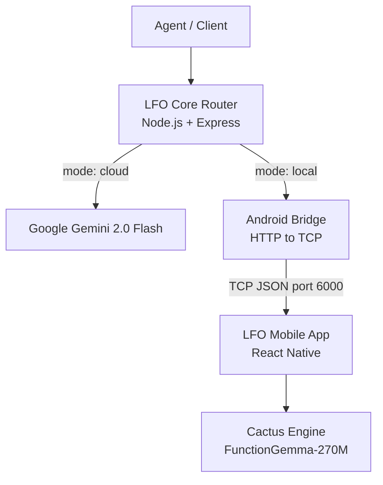

# LocalFirst Orchestrator (LFO)
Hybrid inference router for local-plus-cloud LLMs via a single OpenAI-compatible endpoint

[](#)
[](#)
[](#)

## Description

LFO is a self-hosted hybrid inference router that exposes one OpenAI-compatible `/v1/chat/completions` endpoint and routes each request to either a local Android-hosted FunctionGemma model or a cloud Gemini model. It is designed for agentic systems that need fast, private on-device inference when possible and powerful cloud models when necessary.

LFO implements a **two-phase hybrid routing strategy**: a token pre-filter (Phase 1) skips local inference when prompt complexity exceeds a configurable threshold, and confidence-aware escalation (Phase 2) automatically re-routes to Gemini if FunctionGemma's confidence score falls below 0.7. Every response includes an `lfo_metadata` field exposing `confidence`, `routing_reason`, and `local_attempt` for full observability.

**Target users:** Developers building LLM agents and tools that want edge + cloud hybrid inference behind a single, reusable service.

> For full system design, data flows, security model, and trade-off decisions, see [ARCHITECTURE.md](./ARCHITECTURE.md).

## Table of Contents

- [Description](#description)
- [Features](#features)
- [Tech Stack](#tech-stack)
- [Architecture Overview](#architecture-overview)
- [How Routing Works](#how-routing-works)
- [Component Details](#component-details)
- [Installation](#installation)
- [Usage](#usage)
- [Configuration](#configuration)
- [Screenshots / Demo](#screenshots--demo)
- [API / CLI Reference](#api--cli-reference)
- [Tests](#tests)
- [Security](#security)
- [Roadmap](#roadmap)
- [Contributing](#contributing)
- [License](#license)
- [Contact / Support](#contact--support)

## Features

- OpenAI-compatible `/v1/chat/completions` endpoint for drop-in integration.
- Per-request routing via `metadata.mode` (`local | cloud | auto`).
- **Two-phase hybrid routing**: token pre-filter + FunctionGemma confidence-based cloud escalation.
- Local path via Cactus Engine + FunctionGemma-270M on Android (sub-100ms LAN latency).
- Cloud path via Google Gemini 2.0 Flash for long-context and complex requests.
- Full **tool/function-calling** support on both local and cloud backends.
- `lfo_metadata` in every response: `confidence`, `routing_reason`, `local_attempt`.
- Circuit breaker on Android path (`CLOSED` / `OPEN` / `HALF_OPEN`) — fast-fail on offline device.
- Optional bearer token authentication via `LFO_AUTH_TOKEN`.
- Web UI dashboard at `/dashboard` for real-time request logs and backend health.
- 45/45 unit tests using `node:test` with injectable mock providers.

## Tech Stack

| Layer | Technology |
|---|---|
| Router | Node.js 18+, TypeScript 5 (strict), Express 4 |
| Local inference | Cactus Engine (`cactus-react-native`), FunctionGemma-270M (GGUF) |
| Mobile app | React Native (Android), `react-native-tcp-socket` |
| Cloud inference | Google Gemini 2.0 Flash, `@google/generative-ai` SDK |
| Testing | `node:test`, injectable mock providers |
| Scripting | PowerShell (`smoke-test.ps1`, `validate-env.ps1`) |

## Architecture Overview

LFO consists of three layers running across two machines. See [ARCHITECTURE.md](./ARCHITECTURE.md) for the full system design, sequence diagrams, data model, security, and trade-off decisions.



Requests enter the **LFO Core Router**, which authenticates, estimates tokens, and resolves a routing target. Local requests are forwarded to the **Android Bridge** — a Windows-side adapter that converts HTTP into the raw TCP protocol used by the **LFO Mobile App**. The mobile app hosts the Cactus Engine and FunctionGemma-270M on-device, returning structured responses including confidence scores and function calls.

> Full component details, data flow diagrams, and infrastructure notes are in [ARCHITECTURE.md](./ARCHITECTURE.md).

## How Routing Works

LFO's routing logic lives in `lfo-core/src/routing.ts`. The `auto` mode uses a **two-phase strategy**:

**Phase 1 — Token pre-filter**
- Prompt tokens are estimated with a fast `char / 4` heuristic.
- If `estimated_tokens > MAX_LOCAL_TOKENS` (default: 1,500), the request is sent directly to Gemini.

**Phase 2 — Confidence-aware escalation**
- If the local path is attempted, FunctionGemma returns a `confidence` score (0–1).
- If `confidence < confidence_threshold` (default: 0.7), the request is automatically re-sent to Gemini.
- The `routing_reason` in `lfo_metadata` records exactly why each decision was made.

| `mode` value | Behaviour |
|---|---|
| `local` | Always use Android / FunctionGemma. Fails hard if offline. |
| `cloud` | Always use Gemini. |
| `auto` | Phase 1 + Phase 2 hybrid routing (default). |

> See the [Data Flow section of ARCHITECTURE.md](./ARCHITECTURE.md#data-flow) for full sequence diagrams of both routing paths.

## Component Details

### lfo-core
The Express HTTP server. Handles auth, routing decisions, circuit-breaker-wrapped provider calls, error normalisation, usage token accounting, the `/dashboard` UI, and the `/v1/models` endpoint.

### android-bridge
A thin Node.js process on the Windows host. Translates `POST /completion` HTTP calls from lfo-core into newline-delimited JSON over TCP — necessary because Android background lifecycle restrictions prevent React Native from reliably hosting an HTTP server.

### lfo-mobile
A React Native app running on the Android device. Loads FunctionGemma-270M via the Cactus Engine at startup, then listens on TCP port 6000. Returns `{ text, confidence, function_calls }` per request.

> Full responsibility tables, key files, and communication patterns for each component are documented in [ARCHITECTURE.md § Component Details](./ARCHITECTURE.md#component-details).

## Installation

1. **Clone the repository:**
   ```bash
   git clone https://github.com/MasteraSnackin/LFO.git
   cd LFO
   ```
2. **Install dependencies:**
   ```bash
   npm install
   ```
3. **Configure environment:**
   ```bash
   cp .env.example .env
   # Set GEMINI_API_KEY and ANDROID_HOST at minimum
   ```

## Usage

Start the router:
```bash
npm start
```

**Auto-routing request (let LFO decide):**
```bash
curl -X POST http://localhost:8080/v1/chat/completions \
  -H "Content-Type: application/json" \
  -d '{"messages": [{"role": "user", "content": "Hello!"}], "metadata": {"mode": "auto"}}'
```

**Force local inference:**
```bash
curl -X POST http://localhost:8080/v1/chat/completions \
  -H "Content-Type: application/json" \
  -d '{"messages": [{"role": "user", "content": "2+2?"}], "metadata": {"mode": "local"}}'
```

**With tool calling:**
```bash
curl -X POST http://localhost:8080/v1/chat/completions \
  -H "Content-Type: application/json" \
  -d '{"messages": [{"role": "user", "content": "Weather in London?"}], "tools": [{"type": "function", "function": {"name": "get_weather", "description": "Get weather", "parameters": {"type": "object", "properties": {"location": {"type": "string"}}, "required": ["location"]}}}], "metadata": {"mode": "auto"}}'
```

**Example response with routing metadata:**
```json
{
  "model": "lfo-local-functiongemma",
  "choices": [{"message": {"role": "assistant", "content": ""}}],
  "lfo_metadata": {
    "confidence": 0.95,
    "routing_reason": "high_confidence_0.95",
    "local_attempt": true
  }
}
```

## Configuration

| Variable | Default | Description |
|---|---|---|
| `GEMINI_API_KEY` | — | Google AI API key (required) |
| `PORT` | `8080` | Router listen port |
| `ANDROID_HOST` | `127.0.0.1` | Android device LAN IP |
| `ANDROID_PORT` | `555` | Android bridge port |
| `MAX_LOCAL_TOKENS` | `1500` | Token threshold for auto-routing |
| `GEMINI_MODEL` | `gemini-2.0-flash` | Gemini model ID |
| `LFO_AUTH_TOKEN` | — | Optional bearer token for auth |

> Full configuration reference with all variables is in [ARCHITECTURE.md § Infrastructure & Deployment](./ARCHITECTURE.md#infrastructure--deployment).

## Screenshots / Demo


[Live Demo Link](https://github.com/MasteraSnackin/LFO)

## API / CLI Reference

### `GET /health`
Returns `{ status, timestamp, version }`. Always unauthenticated.

### `GET /v1/models`
Returns available model IDs (`lfo-local-functiongemma`, `lfo-gemini`, `lfo-auto`).

### `POST /v1/chat/completions`
OpenAI-compatible chat completion. Accepts standard body plus:
- `metadata.mode` — `"local"` | `"cloud"` | `"auto"`
- `tools` — OpenAI-format function/tool definitions (passed to both backends)
- `confidence_threshold` — override the default 0.7 escalation threshold

Returns standard OpenAI response plus `lfo_metadata` object.

For error code mappings and full request/response schemas, see [ARCHITECTURE.md § Data Model](./ARCHITECTURE.md#data-model-high-level).

## Tests

```bash
cd lfo-core && npm test
```

**45/45 tests passing.** Test coverage includes:
- Routing logic (`estimateTokens`, `resolveMode`, `determineTarget`)
- Auth middleware
- Android circuit breaker (all three states)
- Gemini error mapping (401, 429, 403, timeout)
- Dashboard stats API
- Validation and error handling

All tests use mock providers — no real device or API key required.

## Security

- **Authentication:** Optional bearer token (`LFO_AUTH_TOKEN`) on all inference routes. `/health` is always public.
- **Privacy:** Local path data never leaves the LAN — zero cloud egress for sensitive prompts.
- **Secrets:** `GEMINI_API_KEY` stored in `.env` only, never logged or exposed.
- **Network:** Do not expose port 8080 to the internet without enabling `LFO_AUTH_TOKEN`.

> Full security and compliance details in [ARCHITECTURE.md § Security & Compliance](./ARCHITECTURE.md#security--compliance).

## Roadmap

- [ ] SSE streaming responses on both backends.
- [ ] Multi-device Android pool for local load balancing.
- [ ] Real tokeniser (`tiktoken`) replacing `char/4` heuristic.
- [ ] Dashboard visualisation of confidence scores and routing reasons.
- [ ] Configurable per-tool routing policies.

## Contributing

Please open an issue or PR on GitHub. Follow the standard fork-and-pull-request workflow. Ensure `npm test` passes before submitting.

## License

MIT License. See [LICENSE](./LICENSE) file.

## Contact / Support

Maintainer: MasteraSnackin
GitHub: [MasteraSnackin](https://github.com/MasteraSnackin)
Issues: [github.com/MasteraSnackin/LFO/issues](https://github.com/MasteraSnackin/LFO/issues)
