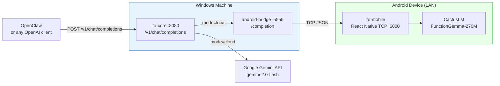

# LocalFirst Orchestrator (LFO)

> Hybrid inference router — run LLMs locally on Android or in the cloud, decided per-request, through one OpenAI-compatible endpoint.


---

## Table of Contents

- [Description](#description)
- [Features](#features)
- [Tech Stack](#tech-stack)
- [Architecture Overview](#architecture-overview)
- [Installation](#installation)
- [Usage](#usage)
- [Configuration](#configuration)
- [API Reference](#api-reference)
- [Tests](#tests)
- [Roadmap](#roadmap)

---

## Description

LFO is a small, self-hosted router that gives agentic systems (like OpenClaw) a single OpenAI-compatible `/v1/chat/completions` endpoint while transparently routing each request to the right backend:

- **Local** — Cactus + FunctionGemma running on an Android phone on your LAN (fast, private, free).
- **Cloud** — Google Gemini 2.x (powerful, long-context, always available).

Routing is controlled by a `metadata.mode` field (`local | cloud | auto`) or automatically by estimated prompt token count. No vendor lock-in. No per-project glue code. One reusable service.

**Target users:** developers building OpenClaw-style agents who want edge + cloud hybrid inference without writing custom routing for every project.

---

## 🆕 What's New — FunctionGemma Integration

**2026-02-21**: LFO now integrates patterns from the [Cactus × DeepMind FunctionGemma hackathon](https://github.com/cactus-compute/functiongemma-hackathon):

- ✅ **Tool calling** — FunctionGemma can execute function calls on-device
- ✅ **Confidence-based routing** — hybrid strategy combines token count + model confidence
- ✅ **Enhanced metadata** — responses include `confidence`, `function_calls`, `routing_reason`
- ✅ **Dual circuit breakers** — Android (30s) + Gemini (60s) protection

**See [`INTEGRATION.md`](./INTEGRATION.md) for complete integration guide, API changes, and testing checklist.**

---

## Features

### Core Routing
- **OpenAI-compatible API** — drop-in replacement for any client that speaks `/v1/chat/completions`.
- **Per-request routing** — `mode=local`, `mode=cloud`, or `mode=auto` (token-count heuristic).
- **Hard-fail semantics** — no silent fallbacks; forced modes error clearly if the backend is down.
- **System message support** — passed to Gemini as `systemInstruction`; forwarded to Cactus.
- **Structured errors** — every failure maps to a typed error code in OpenAI error format.
- **Usage token accounting** — `prompt_tokens / completion_tokens / total_tokens` in every response.

### FunctionGemma Integration (NEW ✨)
- **Tool calling support** — pass `tools` array for on-device function calling with FunctionGemma.
- **Confidence-based routing** — model returns confidence score (0-1); auto-escalate to cloud if below threshold.
- **Cloud handoff flag** — FunctionGemma can explicitly recommend cloud escalation.
- **Hybrid routing strategies** — combine token pre-filter + confidence-based fallback (mirrors [Cactus × DeepMind hackathon](https://github.com/cactus-compute/functiongemma-hackathon) patterns).
- **Enhanced response metadata** — `function_calls`, `confidence`, `routing_reason` in responses.

### Operations
- **Optional bearer token auth** — set `LFO_AUTH_TOKEN` to lock the endpoint.
- **Dual circuit breakers** — Android (30s) + Gemini (60s) protection with OPEN/HALF_OPEN states.
- **Graceful shutdown** — SIGTERM/SIGINT handlers persist stats and drain connections.
- **Health endpoints** — `GET /health` + `GET /v1/models` for client compatibility.
- **45 automated tests** — unit + HTTP integration, no real network required.
- **Web UI dashboard** — `GET /dashboard` shows live request log, backend status, latency, and routing split.

---

## Tech Stack

| Layer | Technology |
|---|---|
| Router | Node.js 18+ · TypeScript 5 (strict) · Express 4 |
| Local inference | Cactus + FunctionGemma-270M · React Native · Android |
| Local bridge | Node.js HTTP→TCP bridge (`android-bridge/`) |
| Cloud inference | Google Gemini 2.x · `@google/generative-ai` |
| Transport | HTTP/JSON (no streaming in v0) |
| Tests | `node:test` — no external framework |

---

## Architecture Overview



**3-hop local path:** `lfo-core` → `android-bridge` (HTTP on Windows) → `lfo-mobile` (TCP on Android) → CactusLM. The bridge translates HTTP calls into the newline-delimited JSON protocol used by the mobile TCP server.

**Cloud path:** `lfo-core` calls the Gemini SDK directly. System messages are extracted and passed as `systemInstruction`.

See [ARCHITECTURE.md](ARCHITECTURE.md) for the full design document.

---

## Installation

### Prerequisites

- Node.js ≥ 18 (LFO confirmed on v24)
- Android device on the same WiFi network
- Google AI API key (`GEMINI_API_KEY`)
- ADB in PATH (for pushing model file to Android)

### 1. Install dependencies

```bash
cd lfo-core   && npm install
cd ../android-bridge && npm install
cd ../lfo-mobile     && npm install
```

### 2. Configure lfo-core

```bash
cd lfo-core
cp .env.example .env
# Set GEMINI_API_KEY at minimum
```

### 3. Set up Android (local path only)

Full SOP: [directives/android_setup.md](directives/android_setup.md)

```bash
# Push model file to device
adb push function-gemma-270m.gguf /sdcard/function-gemma-270m.gguf

# Build and start the RN app
cd lfo-mobile && npm run android
# Wait for app to show "Ready on port 6000"

# Configure and start the bridge
cd android-bridge
cp .env.example .env   # set ANDROID_HOST to device LAN IP
node index.js
```

### 4. Start LFO

```bash
cd lfo-core && npm run dev
```

---

## Usage

### Health check

```bash
curl http://localhost:8080/health
```

### Cloud request

```bash
curl -s -X POST http://localhost:8080/v1/chat/completions \
  -H "Content-Type: application/json" \
  -d '{"messages":[{"role":"user","content":"What is the capital of France?"}],"metadata":{"mode":"cloud"}}'
```

### Local request

```bash
curl -s -X POST http://localhost:8080/v1/chat/completions \
  -H "Content-Type: application/json" \
  -d '{"messages":[{"role":"user","content":"What is 2+2?"}],"metadata":{"mode":"local"}}'
```

### With auth enabled

```bash
curl -s -X POST http://localhost:8080/v1/chat/completions \
  -H "Authorization: Bearer my-secret-token" \
  -H "Content-Type: application/json" \
  -d '{"messages":[{"role":"user","content":"Hi"}]}'
```

### OpenClaw config

```yaml
llm:
  provider: openai-compatible
  base_url: http://localhost:8080
  model: lfo-auto
  api_key: ""   # set to LFO_AUTH_TOKEN value if auth is enabled
```

Full guide: [directives/openclaw_integration.md](directives/openclaw_integration.md)

---

## Configuration

### `lfo-core/.env`

| Variable | Default | Required | Description |
|---|---|---|---|
| `PORT` | `8080` | No | LFO listen port |
| `HOST` | `0.0.0.0` | No | LFO listen host |
| `GEMINI_API_KEY` | — | **Yes** | Google AI API key |
| `GEMINI_MODEL` | `gemini-2.0-flash` | No | Gemini model ID |
| `ANDROID_HOST` | `127.0.0.1` | No | android-bridge host |
| `ANDROID_PORT` | `5555` | No | android-bridge port |
| `MAX_LOCAL_TOKENS` | `1500` | No | Auto-routing token threshold |
| `LFO_AUTH_TOKEN` | — | No | Bearer token (disables open access if set) |

### `android-bridge/.env`

| Variable | Default | Description |
|---|---|---|
| `BRIDGE_PORT` | `5555` | Bridge listen port |
| `ANDROID_HOST` | `192.168.0.50` | Android device LAN IP |
| `ANDROID_PORT` | `6000` | lfo-mobile TCP port |
| `ANDROID_TIMEOUT_MS` | `30000` | TCP timeout in ms |

---

## API Reference

### `GET /health`

```json
{ "status": "ok", "timestamp": 1708123456, "version": "0.1.0" }
```

### `POST /v1/chat/completions`

**Request body:**

```json
{
  "messages": [
    { "role": "system", "content": "You are a helpful assistant." },
    { "role": "user", "content": "Hello!" }
  ],
  "max_tokens": 256,
  "temperature": 0.7,
  "metadata": { "mode": "auto" }
}
```

**Success response:**

```json
{
  "id": "chatcmpl-1708123456-abc123def",
  "object": "chat.completion",
  "created": 1708123456,
  "model": "lfo-local-functiongemma",
  "choices": [{ "index": 0, "message": { "role": "assistant", "content": "Hello!" }, "finish_reason": "stop" }],
  "usage": { "prompt_tokens": 18, "completion_tokens": 3, "total_tokens": 21 }
}
```

**Error response:**

```json
{ "error": { "message": "...", "type": "service_unavailable", "code": "local_error" } }
```

| HTTP | `error.type` | Cause |
|---|---|---|
| 400 | `invalid_request_error` | Missing/empty `messages`, or malformed message shape |
| 401 | `authentication_error` | Missing/wrong bearer token |
| 403 | `quota_exceeded` | Gemini API quota exceeded |
| 413 | `invalid_request_error` | Request body exceeds 2mb |
| 429 | `rate_limit_exceeded` | Gemini rate limit |
| 501 | `not_implemented` | `stream: true` in request body |
| 502 | `lfo_provider_error` | Other provider error |
| 503 | `service_unavailable` | Android unreachable / circuit open |
| 504 | `lfo_timeout` | Provider timeout |

---

## Tests

```bash
cd lfo-core && npm test
```

Tests use mock providers — no Android device or Gemini key needed.

```
✔ GET /health (1)
✔ POST /v1/chat/completions — validation (7)
✔ POST /v1/chat/completions — routing (4)
✔ POST /v1/chat/completions — error handling (2)
✔ POST /v1/chat/completions — timeout (1)
✔ Auth middleware (4)
✔ GET /dashboard/api/stats (5)
✔ estimateTokens (3)
✔ resolveMode (7)
✔ determineTarget (4)
✔ Android circuit breaker (4)
tests 42, pass 42, fail 0
```

---

## Roadmap

### v0 (current — complete)
- [x] OpenAI-compatible endpoint
- [x] Local (Cactus) + cloud (Gemini) paths
- [x] Auto-routing by token count
- [x] Structured error mapping (400/401/403/413/429/501/502/503/504)
- [x] Usage token accounting
- [x] Optional bearer token auth
- [x] Android circuit breaker (CLOSED/OPEN/HALF_OPEN with mutex)
- [x] Web UI dashboard — `GET /dashboard` (request log, latency, routing split, circuit state)
- [x] 42 automated tests

### v1 (planned)
- [ ] Streaming responses (SSE)
- [ ] Tool-call aware routing
- [ ] Configurable per-user / per-tool routing policies
- [ ] Multi-device local pool
- [ ] Token cost tracking
