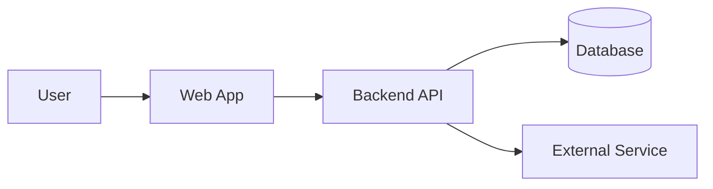

# LocalFirst Orchestrator (LFO)
Hybrid inference router for local‑plus‑cloud LLMs via a single OpenAI-compatible endpoint

[](#)
[](#)
[](#)

## Description

LFO is a self-hosted hybrid inference router that exposes one OpenAI-compatible `/v1/chat/completions` endpoint and routes each request to either a local Android-hosted FunctionGemma model or a cloud Gemini model. It is designed for agentic systems that need fast, private on-device inference when possible and powerful cloud models when necessary.

**Target users:** Developers building LLM agents and tools that want edge + cloud hybrid inference behind a single, reusable service.

## Table of Contents

- [Description](#description)
- [Features](#features)
- [Tech Stack](#tech-stack)
- [Architecture Overview](#architecture-overview)
- [Installation](#installation)
- [Usage](#usage)
- [Configuration](#configuration)
- [Screenshots / Demo](#screenshots--demo)
- [API / CLI Reference](#api--cli-reference)
- [Tests](#tests)
- [Roadmap](#roadmap)
- [Contributing](#contributing)
- [License](#license)
- [Contact / Support](#contact--support)

## Features

- OpenAI-compatible `/v1/chat/completions` endpoint.
- Per-request routing via `metadata.mode` (`local | cloud | auto`).
- Automatic routing using prompt token estimation and FunctionGemma confidence scores.
- Local path via Cactus + FunctionGemma on Android.
- Cloud path via Google Gemini 2.x.
- Tool-calling support on-device using FunctionGemma.
- Web UI dashboard at `/dashboard` for request logs and backend status.

## Tech Stack

- **Router:** Node.js, TypeScript, Express
- **Local inference:** Cactus + FunctionGemma-270M, React Native (Android)
- **Cloud inference:** Google Gemini 2.x
- **Testing:** `node:test`

## Architecture Overview



The system uses a Node.js-based router to manage requests between local Android devices and cloud-based LLM providers. The local stack leverages a React Native bridge to communicate with the FunctionGemma engine on-device.

## Installation

1. **Clone the repository:**
   ```bash
   git clone https://github.com/MasteraSnackin/LFO.git
   cd LFO
   ```
2. **Install dependencies:**
   ```bash
   npm install
   ```
3. **Configure environment:**
   ```bash
   cp .env.example .env
   # Add your GEMINI_API_KEY
   ```

## Usage

Run the server locally:
```bash
npm start
```

Example request:
```bash
curl -X POST http://localhost:8080/v1/chat/completions \
  -H "Content-Type: application/json" \
  -d '{"messages": [{"role": "user", "content": "Hello!"}], "metadata": {"mode": "auto"}}'
```

## Configuration

- `GEMINI_API_KEY`: Your Google AI API key.
- `PORT`: Server port (default: 8080).
- `ANDROID_HOST`: IP address of your Android device.

## Screenshots / Demo


[Live Demo Link](https://github.com/MasteraSnackin/LFO)

## API / CLI Reference

### `POST /v1/chat/completions`
Standard OpenAI format with optional `metadata` for routing control.

## Tests

Run the test suite:
```bash
npm test
```

## Roadmap

- [ ] Support for streaming responses.
- [ ] Multi-device load balancing.
- [ ] Advanced token cost estimation.

## Contributing

Please open an issue or PR on GitHub. Follow the standard fork-and-pull-request workflow.

## License

State license type and reference [LICENSE](./LICENSE) file.

## Contact / Support

Maintainer: MasteraSnackin
GitHub: [MasteraSnackin](https://github.com/MasteraSnackin)
