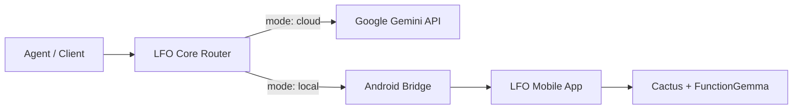

# LocalFirst Orchestrator (LFO)
Hybrid inference router for local-plus-cloud LLMs via a single OpenAI-compatible endpoint

[](#)
[](#)
[](#)

## Description
LFO is a self-hosted hybrid inference router that exposes one OpenAI-compatible `/v1/chat/completions` endpoint and routes each request to either a local Android-hosted FunctionGemma model or a cloud Gemini model. It is designed for agentic systems that need fast, private on-device inference when possible and powerful cloud models when necessary. By implementing a two-phase hybrid routing strategy—combining token-count pre-filtering with confidence-aware escalation—LFO ensures that agents remain responsive and capable while prioritising local execution to reduce latency and API costs.

**Target users:** Developers building LLM agents and tools that require edge-plus-cloud hybrid inference behind a single, reusable service.

## Table of Contents
- [Description](#description)
- [Features](#features)
- [Tech Stack](#tech-stack)
- [Architecture Overview](#architecture-overview)
- [Installation](#installation)
- [Usage](#usage)
- [Configuration](#configuration)
- [Screenshots / Demo](#screenshots--demo)
- [API / CLI Reference](#api--cli-reference)
- [Tests](#tests)
- [Roadmap](#roadmap)
- [Contributing](#contributing)
- [License](#license)
- [Contact / Support](#contact--support)

## Features
- **OpenAI-Compatible**: Drop-in replacement for any client using the standard chat completions endpoint.
- **Hybrid Routing**: Per-request decision making via `metadata.mode` (`local | cloud | auto`).
- **Confidence Escalation**: Automatically re-routes to cloud if the local model's confidence score falls below a threshold.
- **Local-First**: Fast, private inference on Android via Cactus Engine + FunctionGemma-270M.
- **Cloud Power**: Seamless access to Google Gemini 2.x for long-context and complex reasoning.
- **Tool Calling**: Native support for function calling on both local and cloud backends.
- **Resiliency**: Built-in circuit breaker for the local path to prevent offline device blocking.
- **Observability**: Real-time request logging and provider health metrics via an internal dashboard.

## Tech Stack
- **Router**: Node.js, TypeScript, Express
- **Local Inference**: Cactus Engine, FunctionGemma-270M (GGUF)
- **Cloud Inference**: Google Gemini 2.x (`@google/generative-ai`)
- **Mobile Host**: React Native (Android), `react-native-tcp-socket`
- **Testing**: `node:test` with mock providers

## Architecture Overview



The system uses a Node.js-based core router to manage request flow between local and cloud providers. Requests are intelligently routed based on token heuristics or explicit metadata, with local traffic forwarded via a dedicated bridge to the mobile inference host.

## Installation

1. **Clone the repository:**
   ```bash
   git clone https://github.com/MasteraSnackin/LFO.git
   cd LFO
   ```

2. **Install core dependencies:**
   ```bash
   cd lfo-core && npm install
   ```

3. **Configure environment:**
   ```bash
   cp .env.example .env
   # Set at minimum:
   # GEMINI_API_KEY=<your_key>
   # ANDROID_HOST=<device_ip>
   ```

4. **Prepare Android Device:**
   Ensure the LFO Mobile App is installed and running on a device within the same LAN.

## Usage

**Start the orchestrator:**
```bash
npm start
```

**Execute a hybrid request:**
```bash
curl -X POST http://localhost:8080/v1/chat/completions \
  -H "Content-Type: application/json" \
  -d '{
    "messages": [{"role": "user", "content": "What is 2+2?"}],
    "metadata": {"mode": "auto"}
  }'
```

## Configuration
LFO is primarily configured via environment variables in the `lfo-core` directory:

- `GEMINI_API_KEY`: Required for cloud escalation.
- `PORT`: HTTP port for the router (default: `8080`).
- `ANDROID_HOST`: LAN IP address of the Android inference host.
- `MAX_LOCAL_TOKENS`: Maximum prompt length for local routing (default: `1500`).
- `LFO_AUTH_TOKEN`: Optional bearer token for endpoint security.

## Screenshots / Demo

*The internal dashboard provides visibility into routing decisions, latency, and model confidence scores.*

## API / CLI Reference
### `POST /v1/chat/completions`
Accepts standard OpenAI payloads. Custom routing is controlled via the `metadata` object:

```json
{
  "messages": [...],
  "metadata": {
    "mode": "local",
    "confidence_threshold": 0.7
  }
}
```
Responses include `lfo_metadata` containing the actual `confidence` score and the `routing_reason`.

## Tests
The project uses the built-in Node.js test runner for unit and integration testing.
```bash
cd lfo-core && npm test
```
The suite includes 45+ tests covering routing logic, circuit breaker states, and error mapping across providers.

## Roadmap
- [ ] Support for Server-Sent Events (SSE) streaming.
- [ ] Multi-device load balancing for local inference clusters.
- [ ] Integration with `tiktoken` for precise tokenisation.
- [ ] Persistent storage for usage statistics and historical performance.

## Contributing
Contributions are welcome via GitHub issues and pull requests. Please ensure all tests pass before submitting changes.

## License
This project is licensed under the MIT License - see the [LICENSE](./LICENSE) file for details.

## Contact / Support
- **Maintainer**: MasteraSnackin
- **GitHub**: [MasteraSnackin](https://github.com/MasteraSnackin)
- **Issues**: [Project Issues](https://github.com/MasteraSnackin/LFO/issues)
